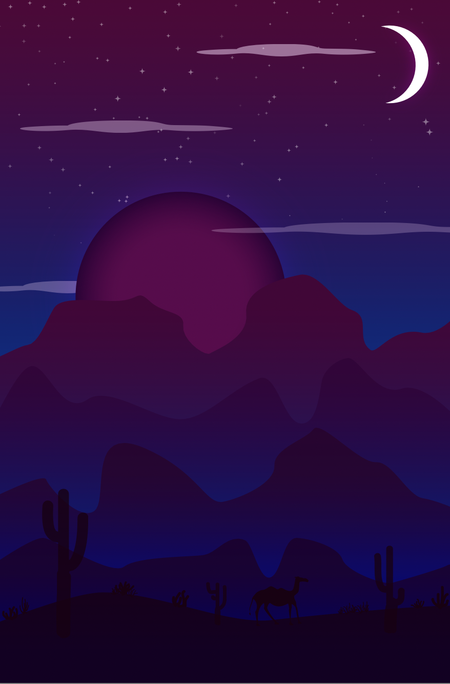

# HOME
## About
Hi, I’m Vy! I am a student at Drexel University majoring in User Experience and Interaction Design. Through the purpose of user experience, we bridge the gap between technology and art. I strive to design experiences that connect and inspire users everywhere. Digital design is always expanding and I want to contribute to making it more accessible, more enjoyable and easier for everyone to use. Together, let’s explore the potential in UXID to create greater things.
## Resume
Vy Le

610-570-9932

vpl26@drexel.edu

#### EDUCATION
Drexel University							

*Philadelphia, PA*
Bachelor of Science in User Experience & Interaction Design
Anticipated Graduation: June 2027		
Cumulative GPA: 3.9
#### PROFESSIONAL SKILL
Business Software: Microsoft Office (Word, Excel, etc), Google Suite (Docs, Sheets, etc) 

Design Software: Adobe Creative Cloud (Illustrator, Photoshop, After Effects, Premiere) 

Languages: Vietnamese
#### RELEVANT COURSEWORK
Intro to Web Development
Computer Imaging I 
Game Design I 
Intro to Design I
Foundational Tools for Animation & VFX
#### WORK EXPERIENCE
*Vanderwende Cream Farmery*		

Philadelphia, PA

Ice Cream Server						

June 2022 - Present

Handled cash and credit transactions of up to $800 a day in an efficient manner to satisfy customers Delivered friendly and inviting attitude to customers to provide a positive experience Demonstrated strong communication and teamwork skills among staff to keep an orderly workplace

*Juju Salon & Organics*	

Philadelphia, PA

Assistant

June 2021 - August 2021

Facilitated clean and enjoyable environments to satisfy customers Monitored items and restocked when needed to make efficient use of downtime Provided assistance to stylists including sanitizing tools and communicating with clients to contribute to a smoother work flow

*WorkReady Summer Program*	

Philadelphia, PA

ESL Student Leader

June 2019 - August 2019

Collaborated with ESL teacher to compose lesson plans for students that will enrich their skills Listened and answered to students' concerns to help create a more comforting atmosphere Maintained a detailed a spreadsheet of information regarding the classroom and academics to remain srganized

## Portfolio
()
DesertExercise_VyLe: For this exercise, the purpose of it was to become more familiar with the gradient tool within Adobe Illustrator. I recreated a desert landscape and experimented with a color palette. Using the different gradients and colors, I was able to create a certain depth in the picture to show the full scenery. I incorporated other skills within the exercise such as precise pen tool use for the small features at the bottom and also other brushes to create the scattered look of stars.

Drawing_VyLe: For this exercise, the purpose of this was to practice pen tool precision and become more familiar with the power the pen tool has. My objective was to make a sketch of any real-life view using the pen tool. I chose a corner of my dorm which contained many intricate lines and folds to really challenge myself when it came to the pen tool. In the end, my precision increased and I became more used to the different usages the pen tool had and learned to use it more efficiently.

FinalPosterPiece: For the project, my objective was to pick any social issue and to create a campaign poster for it as my final project in one of my graphic design courses. While going through this process, I was supposed to incorporate many of the elements that I learned during the class.

In the end, I was able to come up with this campaign poster for homophobia during pride month. I used many of the same techniques I learned in class but also incorporated new techniques that I envisioned when I first came up with the piece. This piece received a large amount of positive feedback but also a fair amount of criticism that I can use to apply for future projects.

Moonlight_VyLe: For this exercise, it was a simple and short activity that focused on strategically overlapping layers and more pen tool practice. I was also able to play around with transparency within layers in this activity to create shadows and more depth. I used different shades of the same color to add on to the depths and create more of a spotlight for the main subject in this.

Ninja_VyLe: For this exercise, the purpose of it was to explore a majority of Adobe Illustrator to become familiar with certain tools and the possibilities the program has. I created these ninjas using the same technique but differing it for each of them to create new poses. Similarly, I also was able to learn new techniques when it came to the weapons that the ninjas hold. I also experimented with stroke weights and adding multiple strokes to create that depth within the characters.

SelfPortrait_VyLe: For this exercise, it was inspired by pop art. The main objective was to experiment with colors and include the elements that we see from famous artists such as Andy Warhol. I experimented with patterns and the placements of where I would want them. I also paid attention to shadows and highlights and made sure to include them in this piece.

SkullExercise_VyLe: For this exercise, it was one of my first experiences with Adobe Illustrator so the objective was to mess around with the program and become more used to all the tools it had to offer. I ended up going off of a pink and red color palette to create this skull. I used lots of different tools, techniques, strokes, etc. in this exercise that prepared me for later projects.

SocialMedia_VyLe: For this small project, the objective was to create a social media poster that would allow an audience to get to know you better but to also keep it short. I included small fun facts so that it would feel more personal and then when posted, it would be followed by a description as well. I picked purple and pink as my main colors to go for a playful aura for this social media post. In the end, it was a fun and quick project to work on to show more of my design style and personality.

DramaticBW_VyLe: For this exercise, the main objective was to become more familiar with layers and the tools Adobe Photoshop has to offer. I mainly learned the mask tool for this activity. I turned the entire picture black and white and picked a subject to bring color back to. In the end, it creates a bold contrast between the color and the gray colors.

OldPhoto_VyLe: For this project, it was similar to the Dramatic B&W exercise but expanded on those techniques used. The objective was to find a black & white image and fully recolor it. The brush and paint tool were heavily used for this project. Precision and accuracy in color were helpful when completing this as well. While being a tedious project, it allowed me to learn many new techniques to create more of a realistic recolor.

AsymmetricalPiece_VyLe: For this project, the main objective was to play around with negative and positive space and then add in another element, the space when B&W were mixed. I looked at a variety of pictures and magazines to then find intricate outlines within the spaces to create new biomorphic and abstract shapes.

With all my new shapes, I assembled them into a composition that I found interesting enough. After that, I carefully chose what I wanted to be black, white or gray. The project required a large amount of precision since all of the lines were free-handed with paint. In the end, I was able to create an asymmetrical piece that allowed me to introduce myself to mixing positive and negative spaces.

## Contact
Let's get in touch!

Email me at vpl@drexel.edu with inquiry. From there, we will further discuss the possibilities we have togther.